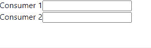

# Recoil demo

State management in React with Recoil.

Similar to Context or Redux, Recoil is presented as a more efficient and simple way to share the state between the app components. It is experimental. Learn more in https://recoiljs.org/.

### Create a react app

`npx create-react-app recoil-demo`

### Add Recoil

`npm install recoil`

### Basis: An atom will be a piece of the state

```javascript
const textState = atom({
  key: "sharedValue", // unique ID (with respect to other atoms/selectors)
  default: "", // default value (aka initial value)
});
```

### Basis: The atom can be consumed by the components

```javascript
const [sharedValue, setSharedValue] = useRecoilState(textState);
```

### Consumer1.js

```javascript
import { atom, useRecoilState } from "recoil";

const textState = atom({
  key: "sharedValue", // unique ID (with respect to other atoms/selectors)
  default: "", // default value (aka initial value)
});

export function Consumer1() {
  const [sharedValue, setSharedValue] = useRecoilState(textState);
  return (
    <div>
      Consumer 1
      <input
        value={sharedValue}
        onChange={(e) => setSharedValue(e.target.value)}
      />
    </div>
  );
}
```

### Consumer2.js

```javascript
import { atom, useRecoilState } from "recoil";

const textState = atom({
  key: "sharedValue", // unique ID (with respect to other atoms/selectors)
  default: "", // default value (aka initial value)
});

export function Consumer2() {
  const [sharedValue, setSharedValue] = useRecoilState(textState);
  return (
    <div>
      Consumer 2
      <input
        value={sharedValue}
        onChange={(e) => setSharedValue(e.target.value)}
      />
    </div>
  );
}
```

### App.js

```javascript
import "./App.css";
import { Consumer1 } from "./Consumer1";
import { Consumer2 } from "./Consumer2";
import { RecoilRoot } from "recoil";

function App() {
  return (
    <RecoilRoot>
      <Consumer1 />
      <Consumer2 />
    </RecoilRoot>
  );
}

export default App;
```

### Result


